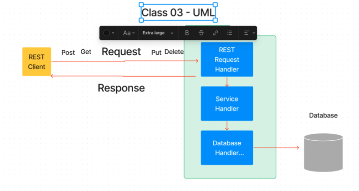

# api-server
# LAB - Class 3

## Project: API-Server

### Author: Tim Maupin

### Problem Domain

Concise Description of why this app exists

### Links and Resources

- [GitHub Actions ci/cd](https://github.com/rkgallaway/server-deployment-practice-d51/actions)
- [back-end server url](http://xyz.com) (when applicable)
- [front-end application](http://xyz.com) (when applicable)

### Collaborators

### Setup

#### `.env` requirements (where applicable)

PORT=

DATABASE_URL=postgres://localhost:5432/(your-datebase-name)

#### How to initialize/run your application (where applicable)

- e.g. `npm start`

#### How to use your library (where applicable)

#### Features / Routes

- Feature One: Details of feature
- GET : `/hello` - specific route to hit

#### Tests

- How do you run tests?
- Any tests of note?
- Describe any tests that you did not complete, skipped, etc

#### UML

